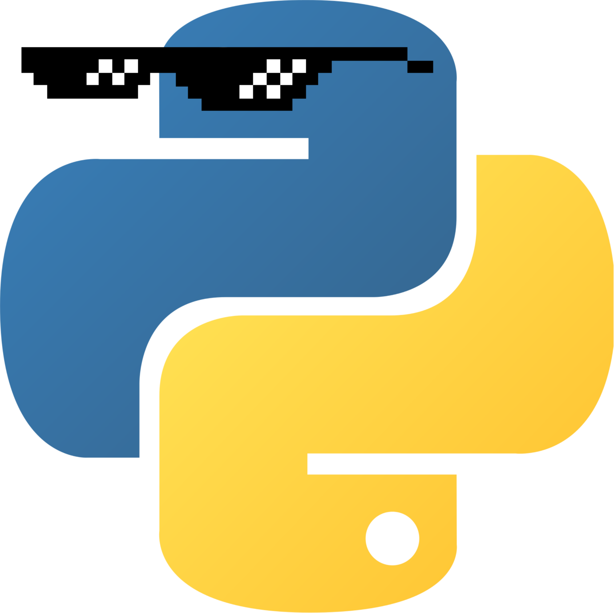

# Notions de Python avancées

Découvrez Python plus en profondeur.

## Lecture

L'ensemble du cours est rédigé en *Markdown* est peut donc être consulté directement depuis *Github* en parcourant le dossier [`src/`](src/).

## Compilation

Le *Makefile* présente des règles de compilation vers deux formats :

* *PDF* : `make cours_python_avance.pdf` (nécessite *pandoc* et *latex*) ;
* Archive *ZIP* *Zeste de savoir* : `make cours_python_avance.pdf` (nécessite *python*).

